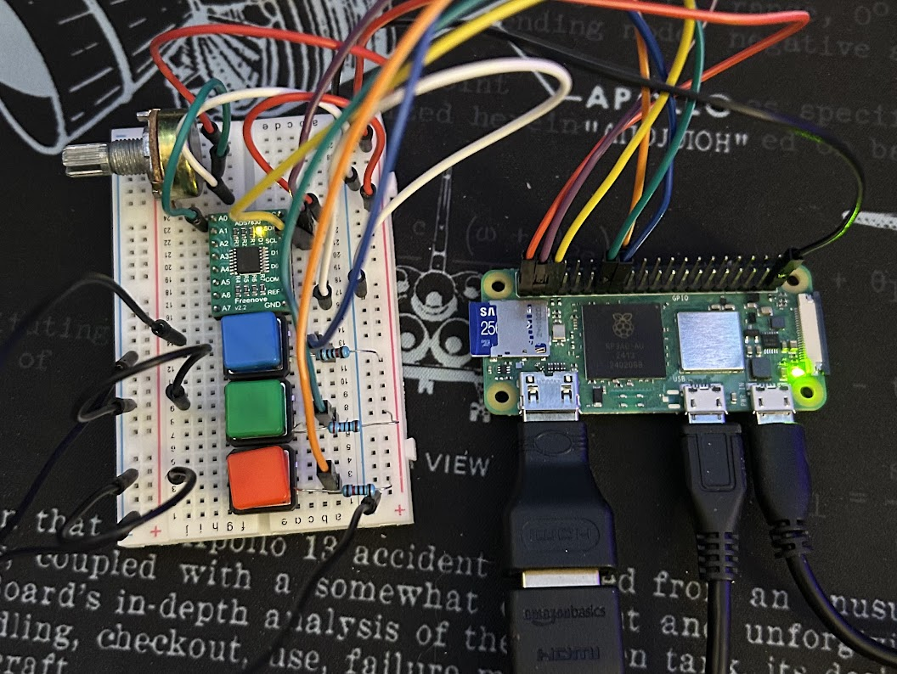

# Pi Thing

## Overview

Pi Thing is a Raspberry Pi Zero 2 W based recreation of the now discontinued Spotify Car Thing.
It provides a touchscreen interface and physical button controls for interacting with Spotify playback via the `Spotify API`.
The project is developed in C, utilizing the `pigpio` library for GPIO handling and `raygui`/`raylib` for the user interface.

## Demo

## Features

- **Spotify Integration**: Control music playback, navigate playlists, and display track information via the Spotify API.
- **Physical Controls**: Utilize GPIO buttons for play/pause, skip, and previous track functionality along with a potentiometer for volume control.
- **Touchscreen GUI**: A responsive and intuitive UI using `raygui` for easy navigation.
- **Real-time Feedback**: Display song progress, volume control, and album artwork.

## Prototype

## Hardware Requirements

- Raspberry Pi Zero 2 W
- Small LCD or OLED touchscreen display (SPI/I2C compatible)
- Potentiometer (for volume control)
- Push buttons for playback controls
- Device with Spotify (Premium)

## Software Dependencies

- **C Compiler** (e.g., `gcc`)
- **pigpio** (for GPIO handling)
- **raylib** (for UI development in C)
    - **raygui** 
- **Spotify API** (for playback control)
- **cJSON** (seamless JSON parsing with C)
- **libcurl** (for API requests to Spotify with C)

## Spotify API Setup

1. Create a Spotify Developer account.
2. Register a new application in the Spotify Developer Dashboard.
3. Obtain the **Client ID** and **Client Secret**.
4. Enter these when starting the Pi Thing app!

## Usage

- Use the touchscreen UI to browse and control music playback on another device with Spotify open.
- Physical buttons allow quick control of playback.
- The potentiometer adjusts the volume and allows for easy scrolling through playlists.

## License

This project is licensed under the MIT License. See `LICENSE` for details.
